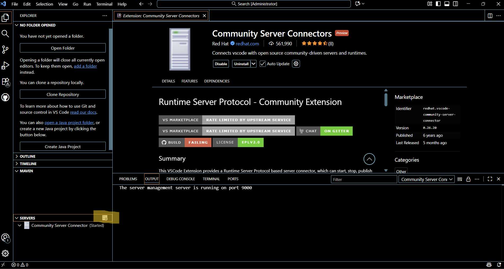
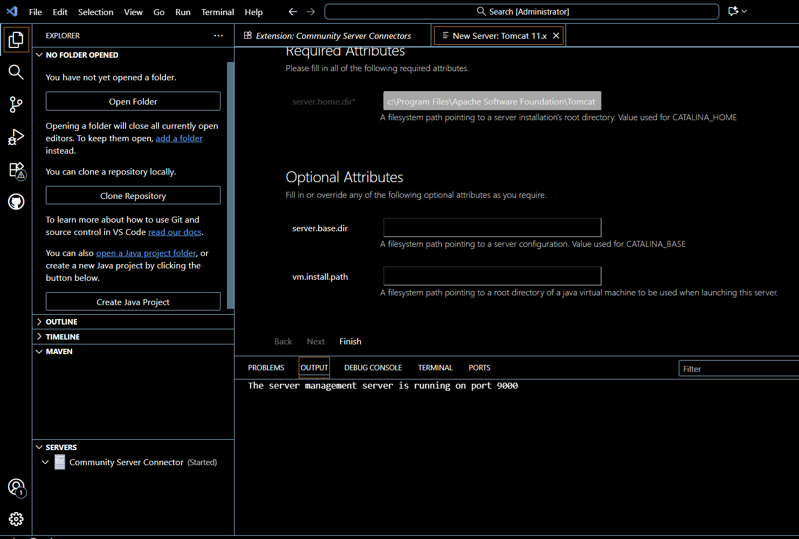

# OpenSourceIce

> 오픈소스 수업 **5조**의 GitHub 저장소입니다.

---

## 이 저장소는 무엇인가요?

이 저장소는 OpenSourceIce 팀원들이 함께 사용하는 공간입니다.
팀 프로젝트 코드, 과제 결과물, 활동 기록 등을 여기서 관리합니다.

GitHub이 처음이라도 괜찮아요! 아래 안내를 따라오시면 충분히 활용할 수 있습니다.

---

## 기술 스택 (예정)

> 아직 확정된 사항은 아니며, 변경될 수 있습니다.

### 백엔드
| 기술 | 역할 |
|---|---|
| **Apache Tomcat 11** | 웹 서버 (자바 프로그램 실행) |
| **SQL** | 데이터베이스 (데이터 저장 및 관리) |

### 프론트엔드
| 기술 | 역할 |
|---|---|
| **Vue 3 + Vite** | 화면 구성 및 사용자 인터페이스 |
| **TailwindCSS** | 스타일링 (디자인) |

> 백엔드와 프론트엔드는 **REST API** 방식으로 연결됩니다.
> 백엔드는 데이터(JSON)만 주고받고, 화면은 Vue가 담당합니다.

---

## 개발 도구 선택: VS Code vs Eclipse

수업 강의자료는 **Eclipse**를 기준으로 진행됩니다.
하지만 일단 저는 **VS Code**를 사용해 개발 환경을 구성했습니다.

### 왜 VS Code를 선택했나요?
- 가볍고 빠르며, 다양한 언어와 프로젝트에서 범용적으로 사용됩니다.
- 확장 프로그램을 통해 Java + Tomcat 개발 환경을 충분히 구성할 수 있습니다.
- Git/GitHub 연동이 편리해 협업에 유리합니다.

### 어떤 도구를 써야 하나요?

| 상황 | 추천 도구 |
|---|---|
| 수업 내용을 따라가기 편한 게 우선 | **Eclipse** |
| 가볍고 빠른 환경을 원한다 | **VS Code** |

> 💡 수업 진도를 따라가기 어렵다면 **Eclipse를 사용하는 것을 추천합니다.**
> 아래 VS Code 설정 방법은 VS Code를 선택한 경우에만 참고하세요.

---

## 개발 환경 설정 (VS Code 기준)

### 1. Java 설치

- **Java 17** 또는 **Java 21** (JDK) 버전을 다운로드하세요.
- 추천: **Java SE 25**

> **JDK**란? 자바 프로그램을 만들고 실행하는 데 필요한 도구 모음입니다.

### 2. Tomcat 설치

- **Tomcat 11** 버전을 설치합니다.

> **Tomcat**이란? 자바로 만든 웹 프로그램을 실제로 실행해주는 서버 프로그램입니다.

### 3. VS Code 확장 프로그램 설치

VS Code에서 자바 + 톰캣 개발을 하려면 아래 두 가지 확장 프로그램을 설치하세요.

| 확장 프로그램 | 설명 |
|---|---|
| **Extension Pack for Java** | Microsoft 공식 자바 개발 필수 팩. 자동 완성, 디버깅 등을 지원합니다. |
| **Community Server Connectors** | VS Code 화면 아래쪽에 톰캣 서버를 등록하고 켜고 끌 수 있게 해주는 도구입니다. |

> 설치 방법: VS Code 왼쪽 사이드바에서 확장(Extensions) 아이콘(네모 4개 모양)을 클릭한 후 이름을 검색하세요.

---

## 내 PC에 있는 톰캣 연결하기

### 1단계: 창 닫기
**Esc** 키를 눌러 지금 떠 있는 서버 목록 창을 꺼주세요.

### 2단계: 메뉴 열기
화면 왼쪽 아래 **Community Server Connector (Started)** 글씨 위에서 마우스 오른쪽 버튼을 클릭합니다.



### 3단계: Create New Server 선택
나오는 메뉴에서 `Download Server`가 아닌, **Create New Server** 를 클릭해 주세요.

### 4단계: 폴더 선택
상단에 **폴더를 선택하라는 알림(Select the server directory)** 이 뜨거나 파일 탐색기 창이 열립니다.

### 5단계: 경로 지정
아래 경로로 이동해서 톰캣 설치 폴더를 선택(Select)해 주세요.

```
C:\Program Files\Apache Software Foundation\Tomcat 11.0
```



---

## GitHub 기본 사용법

### 파일 보기
- 위쪽 폴더 목록을 클릭하면 파일을 볼 수 있어요.
- 코드 파일을 클릭하면 내용을 바로 확인할 수 있습니다.

### 파일 올리기 (업로드)
1. 원하는 폴더로 이동합니다.
2. 오른쪽 위 **Add file > Upload files** 를 클릭합니다.
3. 파일을 끌어다 놓거나 직접 선택합니다.
4. 아래쪽 **Commit changes** 버튼을 눌러 저장합니다.

### 수정 사항 제안하기 (Pull Request)
1. 수정하고 싶은 파일을 열고 오른쪽 위 연필 아이콘(✏️)을 클릭합니다.
2. 내용을 수정한 후 **Propose changes** 를 클릭합니다.
3. 설명을 작성하고 **Create pull request** 를 눌러 제안을 제출합니다.

> ⚠️ 팀원들이 함께 작업하는 공간입니다. **Merge는 함부로 하지 말아주세요.**

---

## 문의

궁금한 점은 카카오톡으로 남겨주세요.

---


